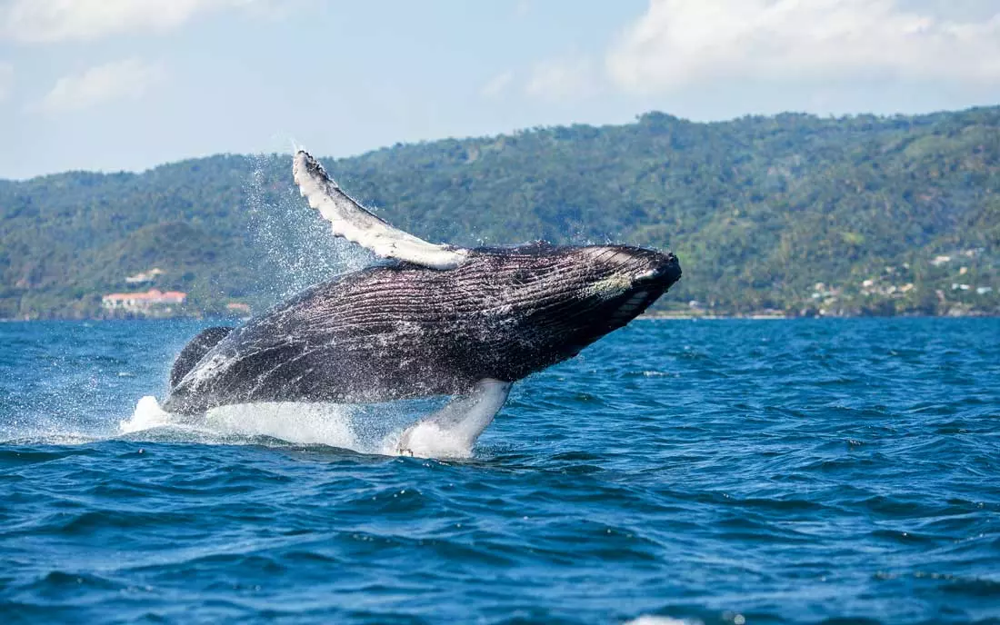

When people think about the Dominican Republic, their minds often drift to images of pristine white sand beaches, swaying palm trees, and the warm, turquoise waters of the Caribbean Sea. While these picturesque scenes are undeniably a part of the country's charm, there's much more to discover, from its rich cultural history to unique natural wonders that make the Dominican Republic a destination full of surprises.

Beyond the beaches lies a rich tapestry of natural wonders, unique wildlife, ancient history, and vibrant culture, all of which contribute to the country's surprising and diverse identity. From the highest peaks in the Caribbean to the depths of its ancient caves, the Dominican Republic is a land of unexpected discoveries waiting to be explored.

## 1. Palmchat, a Unique Bird

The Palmchat (Dulus dominicus), the national bird of the Dominican Republic, is a species found nowhere else in the world, making it endemic to the island of Hispaniola. This small, social bird is often seen in flocks, building large communal nests in palm trees. Its presence and significance in the Dominican Republic's natural heritage underline the island's rich biodiversity.

## 2. Larimar, a Unique Stone

Larimar, a rare blue variety of the mineral pectolite, is found only in the Dominican Republic, specifically in the province of Barahona. The stone’s unique coloration, which ranges from light blue to deep blue, is reminiscent of the Caribbean Sea, making it a sought-after gemstone for jewelry. Its exclusivity to the island has made Larimar a symbol of Dominican pride and a significant aspect of local craftsmanship.

## 3. Ancient Taíno Petroglyphs and Pictographs

The Cueva de las Maravillas, or Cave of Wonders, houses ancient petroglyphs and pictographs created by the Taíno people, the island's original inhabitants. These artworks, etched into the cave walls, offer a glimpse into the spiritual and cultural life of the Taíno civilization, making the cave a significant archaeological site. The preservation of these artifacts provides valuable insights into pre-Columbian history in the Caribbean.

## 4. Hispaniolan Solenodon, Living Fossils

The Hispaniolan solenodon (Solenodon paradoxus) is often referred to as a "living fossil" due to its primitive characteristics that have remained unchanged for millions of years. Although not a dinosaur, this nocturnal, insectivorous mammal is one of the few venomous mammals and is a living link to ancient species that roamed the Earth during the age of dinosaurs. Its survival in the Dominican Republic is a testament to the island's unique and diverse wildlife.

Beyond its unique wildlife, the Dominican Republic's geographical features are just as impressive.

## 5. First European Settlement in the Americas

The Dominican Republic boasts several historical firsts in the Americas. It was the site of the first European settlement in the New World, La Isabela, established by Christopher Columbus in 1493.

## 6. Santo Domingo, Oldest City in the Americas

Santo Domingo, the capital city, holds the title of the oldest continuously inhabited European city in the Americas and is home to the first cathedral, hospital, and university in the New World.

## 7. Pico Duarte, The Highest Point in the Caribbean

The Dominican Republic is home to both the highest and lowest geographical points in the Caribbean. Pico Duarte, standing at 3,098 meters (10,164 feet) above sea level, is the tallest peak in the region.

## 8. Lake Enriquillo, The Lowest Point in the Caribbean

In contrast, Lake Enriquillo, situated at 44 meters (144 feet) below sea level, is the lowest point in the Caribbean, and a hypersaline lake that serves as a habitat for a variety of wildlife, including American crocodiles.

## 9. Dominican Carnaval

Carnaval in the Dominican Republic is a vibrant and colorful celebration that takes place every February. Each region of the country brings its unique flavor to the festivities, with parades, music, dancing, and elaborate costumes that reflect a blend of African, Taíno, and Spanish cultural influences. The event culminates on February 27, the Dominican Independence Day, symbolizing national pride and cultural heritage.

## 10. Go Whale Watching in Samana Bay!

Every year, from January to March, humpback whales migrate to the warm waters of Samaná Bay in the Dominican Republic to mate and give birth. This spectacular natural event attracts visitors from around the world who come to witness the whales' acrobatic displays and hear their haunting songs. Samaná is considered one of the best places in the world for whale watching.

## Conclusion

These fun facts only scratch the surface of what the Dominican Republic has to offer. Whether you're drawn to its history, natural beauty, or vibrant culture, this island nation promises endless discoveries for every type of traveler.
